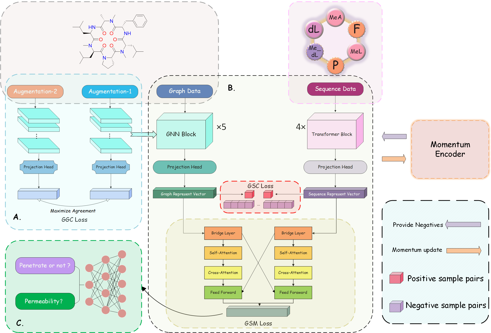

# MuCoCP
PyTorch implementation for *__MuCoCP: A priori chemical knowledge based multimodal contrastive learning pre-trained neural network for the prediction of cyclic peptide membrane penetration ability__*  

YunXiang Yu, MengYun Gu，Hai Guo, Yabo Deng, Danna Chena, Xia Liu*, Jinqi Huang* and Wenjin Yan*

# Abstract   
There has been a burgeoning interest in the field of cyclic peptide therapeutics in recent period due to their various outstanding advantages and strong potential for drug formation. However, it is undoubtedly costly and inefficient to use traditional wet-lab methods to clarify their biological activities. Using Artificial Intelligence instead is definitely a more energy efficient and faster approach. MuCoCP aims to build a complete pre-trained model for extracting potential features of cyclic peptides, which can be fine-tuned to accurately predict cyclic peptide bioactivity on a variety of downstream tasks. To maximise its effectiveness, We use a novel data augmentation method based on a priori chemical knowledge and multiple unsupervised training objective functions to greatly improve the information-grabbing ability of the model. To assay the efficacy of the model, we conducted validation on the membrane-permeability of cyclic peptides which achieved an accuracy of 0.87 and R-squared of 0.503 on CycPeptMPDB using semi-supervised training and obtained an accuracy of 0.84 and R-squared of 0.384 using a model with frozen parameters on an external dataset, corroborating the stability and generalisation ability of MuCoCP. It means that MuCoCP is able to fully explore the high-dimensional information of cyclic peptides and make accurate predictions on downstream bioactivity tasks, which will serve as a guide for the future de novo design of cyclic peptide drugs and promote the development of cyclic peptide drugs. 

# Requirements:
* torch 2.1.0
* torch_geometric 2.4.0
* RDKit 2023.03.3
